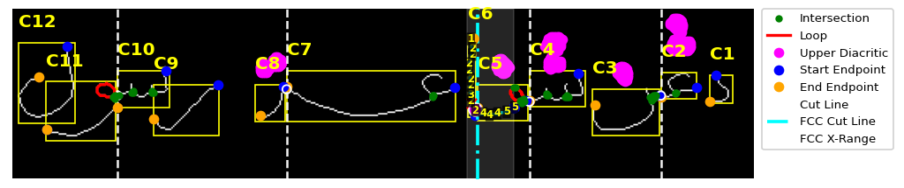
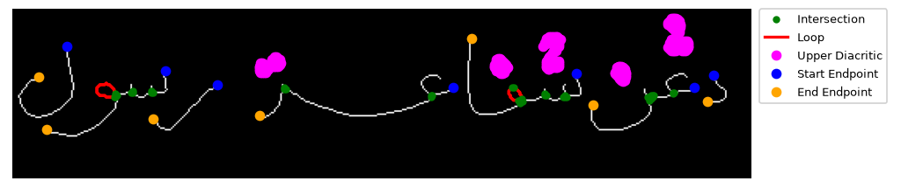
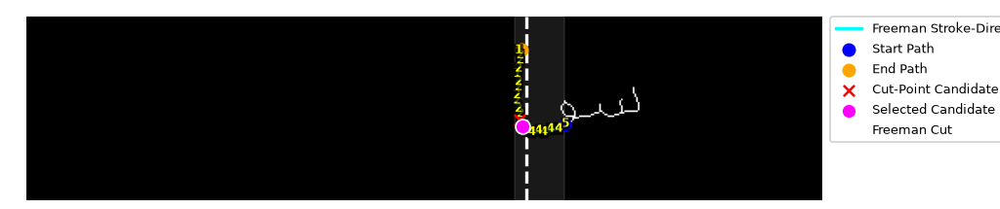
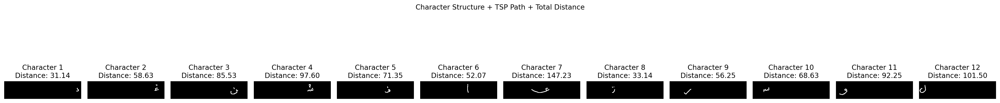
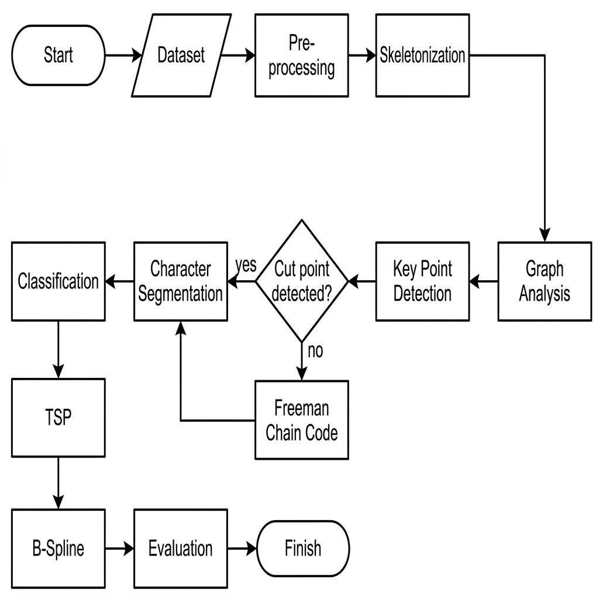

# Segmentasi Citra Tulisan Jawi dengan Graph, FCC, TSP, dan B-Spline

## Deskripsi Umum

Proyek ini merupakan penerapan pengolahan citra untuk melakukan **segmentasi tulisan Jawi/Arab** menjadi karakter-karakter individual. Citra tulisan diproses melalui tahap pra-pemrosesan, skeletonisasi, analisis topologi graf, dan pemotongan rasm atau badan huruf. Hasil segmentasi selanjutnya dianalisis menggunakan Travelling Salesman Problem (TSP) dan direkonstruksi menjadi kurva halus menggunakan B-Spline.

Pendekatan ini dirancang untuk mengenali struktur tulisan yang saling terhubung, membedakan badan huruf dengan diakritik, menentukan titik pemisah karakter, serta mengevaluasi kualitas segmentasi dan pembentukan kurva.

## Citra Asli

Berikut merupakan citra tulisan Jawi yang digunakan sebagai masukan dan akan diproses oleh sistem:

Citra yang digunakan bersumber dari dataset BRIN berikut:

[Dataset Citra Manuskrip pada Repositori Data BRIN](https://data.brin.go.id/dataset.xhtml?persistentId=hdl:20.500.12690/RIN/1JFQSA)

## Metode

Metode yang digunakan dalam proyek ini terdiri atas:

1. **Pra-pemrosesan citra**  
   Citra diubah menjadi grayscale dan biner, kemudian noise berukuran kecil dihapus untuk memperjelas objek tulisan.

2. **Estimasi skala goresan**  
   Lebar goresan dihitung secara dinamis agar parameter pemrosesan dapat mengikuti ukuran tulisan pada citra.

3. **Pemisahan rasm dan diakritik**  
   Komponen utama tulisan diidentifikasi sebagai rasm, sedangkan titik atau tanda di atas dan di bawah tulisan dikenali sebagai diakritik.

4. **Skeletonisasi**  
   Rasm diubah menjadi skeleton setebal satu piksel untuk mempermudah analisis bentuk dan konektivitas.

5. **Analisis topologi graf**  
   Skeleton dimodelkan sebagai graf 8-neighbor untuk mendeteksi endpoint, intersection, titik belok, dan loop.

6. **Freeman Chain Code (FCC)**  
   FCC merepresentasikan arah pergerakan pada skeleton dalam delapan arah. Perubahan arah digunakan sebagai metode tambahan untuk menentukan kandidat titik potong karakter.

7. **Travelling Salesman Problem (TSP)**  
   TSP digunakan untuk mengurutkan titik-titik skeleton sehingga membentuk jalur karakter yang terstruktur.

8. **B-Spline**  
   Titik hasil penelusuran TSP dipilih sebagai control point untuk menghasilkan representasi kurva karakter yang lebih halus dan ringkas.

## Hasil

### Segmentasi Utama

Visualisasi berikut menampilkan skeleton, fitur topologi, area target FCC, garis potong, dan batas setiap karakter hasil segmentasi.

### Deteksi Key Point

Visualisasi key point memperlihatkan endpoint, intersection, loop, serta posisi diakritik pada struktur tulisan.

### Freeman Chain Code

Visualisasi FCC menunjukkan jalur skeleton, kode arah, kandidat titik potong, dan garis potong yang dipilih.

### Jalur TSP

Visualisasi berikut menampilkan jalur penelusuran skeleton dan total jarak TSP pada setiap karakter hasil segmentasi.

### Kurva B-Spline

Setiap karakter hasil segmentasi dibentuk kembali menjadi kurva B-Spline menggunakan control point yang diperoleh dari jalur skeleton.

## Fitur

- Pra-pemrosesan dan binarisasi citra.
- Penghapusan noise berdasarkan luas komponen.
- Estimasi lebar goresan secara dinamis.
- Pemisahan badan huruf dan diakritik.
- Skeletonisasi rasm tulisan.
- Pembentukan graf dengan konektivitas 8-neighbor.
- Deteksi endpoint, intersection, titik belok, dan loop.
- Segmentasi karakter berbasis topologi graf.
- Segmentasi tambahan menggunakan Freeman Chain Code.
- Normalisasi arah FCC untuk tulisan kanan ke kiri.
- Penelusuran skeleton menggunakan TSP.
- Pembentukan kurva karakter menggunakan B-Spline.
- Penyimpanan potongan karakter dan visualisasi hasil.
- Evaluasi segmentasi, jalur TSP, dan kualitas kurva.

## Alur Pemrosesan

## Evaluasi

Evaluasi dilakukan terhadap tiga bagian utama:

### Evaluasi Segmentasi Rasm

Kinerja segmentasi diukur menggunakan jumlah Ground Truth (GT), Detection Total (DT), True Positive (TP), False Positive (FP), dan False Negative (FN). Nilai tersebut digunakan untuk menghitung **accuracy**, **precision**, **recall**, dan **F1-score**.

### Evaluasi Jalur TSP

Evaluasi TSP mencakup jumlah piksel skeleton asli dan total jarak jalur yang terbentuk pada setiap karakter.

### Evaluasi Kurva B-Spline

Kualitas pembentukan kurva dievaluasi berdasarkan jumlah control point, persentase kompresi data, panjang kurva, Root Mean Square Error (RMSE), Mean Absolute Error (MAE), Reconstruction Error (jarak maksimum antara titik skeleton asli dan kurva B-Spline terdekat), dan smoothness.

## Catatan

- Pipeline saat ini dirancang dan disesuaikan untuk satu citra contoh.
- Citra lain mungkin memerlukan penyesuaian parameter segmentasi dan rentang target FCC.
- Jumlah ground truth rasm masih ditentukan secara manual di dalam program.
- Hasil segmentasi dipengaruhi oleh resolusi citra, ketebalan goresan, tingkat noise, jarak antarhuruf, dan posisi diakritik.
- Citra dengan latar yang bersih dan kontras tulisan yang baik akan memberikan hasil pemrosesan yang lebih optimal.

## Kontributor

Dikembangkan oleh [fajrullll](https://github.com/fajrullll).
